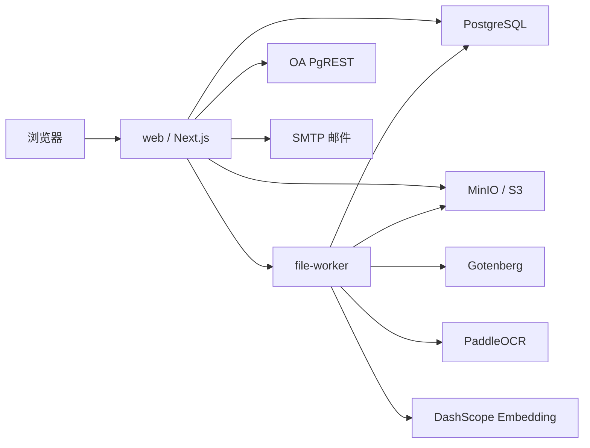

# 系统架构

## 总体架构



## 服务职责

### web

Next.js 应用，负责：

- 页面渲染
- 认证和权限
- 业务服务
- 数据库迁移
- 初始管理员创建
- OA 定时同步
- 文件上传、预览、下载入口
- 文件检索接口

### file-worker

Python 服务，负责：

- 文件预览转换
- 文档内容解析
- OCR 调用
- 文件切片
- 全文索引数据写入
- 向量生成
- 对 Web 暴露内部 query embedding 接口

### PostgreSQL

系统主数据库，包含：

- 业务数据
- pgmq 队列
- pgvector 向量字段
- pg_jieba 中文全文检索
- Drizzle 迁移记录

### MinIO

对象存储，保存：

- 原始文件
- 预览 PDF
- 头像

### Gotenberg

用于 Office 文档转 PDF，供预览和部分解析流程使用。

## 代码分层

Web 侧按 feature-first 组织：

```text
web/src/
├─ app/                 # App Router 页面和 Route Handler
├─ components/          # 跨模块 UI
├─ constants/           # 业务常量
├─ core/                # 基础设施、认证、DB、错误、存储、队列
└─ modules/             # 业务模块
```

约定：

- `app/` 只做页面组合和薄传输层。
- `modules/<domain>/service` 承载业务规则。
- `modules/<domain>/repo` 承载 Drizzle 数据访问。
- `core/` 不依赖业务模块。
- 错误使用 `core/errors`。
- 服务端 action 使用 `core/result` 包装返回。

## 部署形态

当前 Docker Compose 包含：

- `web`
- `file-worker`
- `postgres`
- `minio`
- `gotenberg`

OA 同步定时任务运行在 `web` 容器内。若未来 Web 多副本部署，应只保留一个实例开启 OA 定时，或改用独立调度器。
