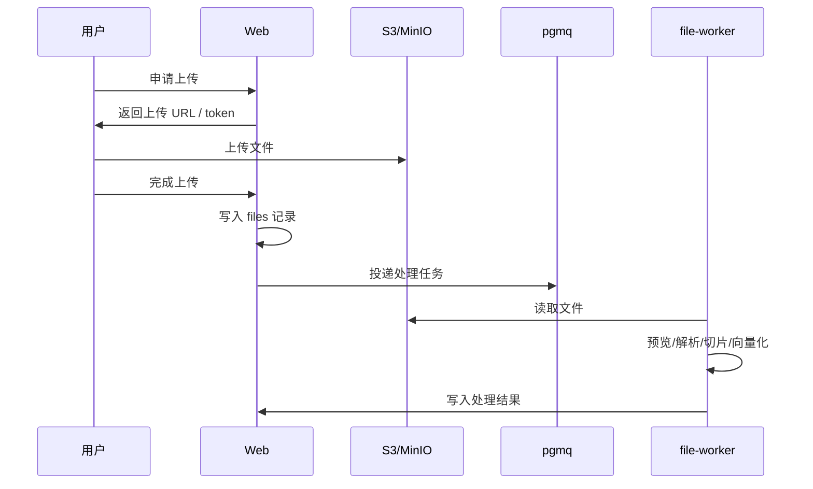

# 文件处理与检索

## 文件模型

文件与以下业务维度关联：

- 项目
- 项目阶段
- 项目所属部门
- 上传人
- 文件类型
- 保密状态
- 销售文件标签
- 成果文件版本

## 文件类型

实施阶段：

- 项目成果文件
- 参考资料：内部资料、客户资料、公开资料

销售阶段：

- 软课题可研立项
- 管理创新可研立项
- 沟通材料
- 项目建议书
- 招采文件筹备
- 其他

## 上传流程

## 预览

Office 文档通过 Gotenberg 转 PDF。PDF、图片等可直接预览或通过代理接口返回。

## 解析策略

- Word / TXT / Markdown：优先直接提取文本。
- Excel / CSV：按 Sheet、行区间或表格块提取。
- PPT / PPT 转 PDF：优先 OCR，按页切片。
- 扫描 PDF：OCR。
- 普通 PDF：按页面和文本结构切片。

## 检索方式

文件搜索支持：

- 元数据匹配
- 全文关键词
- 向量语义
- 混合检索

全文检索基于 PostgreSQL 和中文分词。向量检索基于 pgvector 和 DashScope `text-embedding-v4`。

## 权限过滤

检索必须先做权限过滤，再做排序。无权限查看内容的保密文件可以出现在结果中，但不能预览和下载。

## 处理状态

文件处理通常包含：

1. `preview`
2. `parse`
3. `index`
4. `embed`

各阶段状态记录在数据库中，前端可展示处理进度和失败原因。
